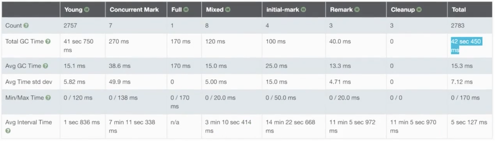

- 设置：
	- JDK5 以后，默认每个线程栈大小都是1M，最少需要228k
		- 如果栈不深，256k-512k 足够
	- 堆大小可以通过 -Xmx 参数设置，栈大小可以通过 -Xss 参数设置
	- ```shell
	  JAVA_OPT="${JAVA_OPT} -Xms1096m -Xmx1096m -XX:MetaspaceSize=128m -XX:MaxMetaspaceSize=128m -Xss512k"''
	  
	  JAVALOPT="${JAVA_OPT} -XX:+PrintGCDetails -XX:+PrintGCTimeStamps -XX:+PrintGCDateStamps -
	  XX:+PrintHeapAtGC -Xloggc:${BASE_DIR}/logs/gc-best-stack. 10g"
	  ```
- 计算最大线程数的公式
	- `Number of threads = (MaxProcess内存- JVM内存 - ReservedosMemory)/(Threadstacksize)`
	- 系统最大可创建的线程数量=（机器本身可用内存-（JVM分配的堆内存+JVM元数据区））/ XSS的值
- 垃圾收集器
	- 吞吐量优先: ps + po
	- 响应优先：parnew+cms
	- 全能： G1
		- 高负载
		- 大内存 (内存小于2GB，不建议使用G1 )
		- ```shell
		  JAVA_OPT="${JAVALOPT} -Xms256m -Xmx256m -XX:Metaspacesize=128m -XX:MaxMetaspacesize=128m -Xss512k"
		  JAVA_OPT="${JAVA_OPT} -XX:+UseG1GC -ХХ:MaxGCPauseMi]is=100"
		  JAVALOPT= "SEJAVA OPT} - XX: +PrintocDetas - XX:+PrintTimestamps -XX: +PrintDatestamps -
		  XX:+PrintHeapAtGC -Xloggc: ${BASE_DIR}/1ogs/gc-g-one. log"
		  ```
		- 
		- 
		-