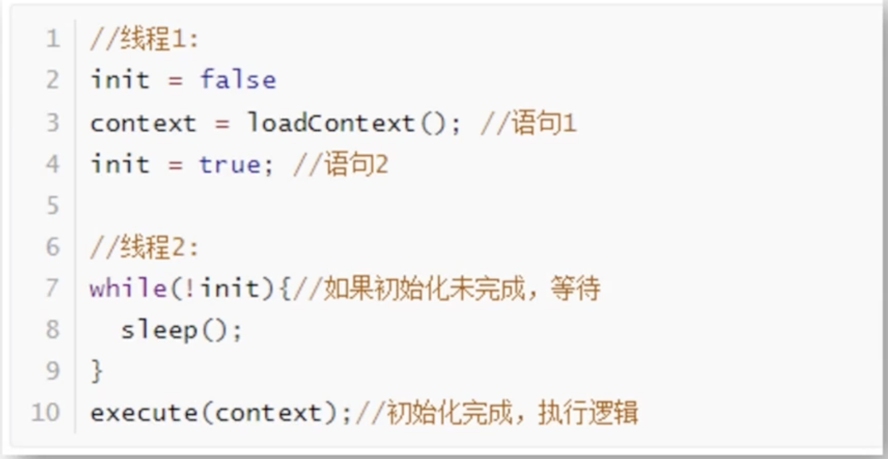

- 原子性
	- 一个系列指令代码，要么全执行，要么都不执行，执行过程不能被打断
- 有序性
	- 程序代码按照先后顺序执行
		- 指令重排：编译器和处理器在不改变程序语义的前提下，重新安排指令的执行顺序
			- 目的：优化程序的执行效率和提高并行度
			- 现象：Java代码语句的先后顺序，不一定是按照我们写的顺序执行
			- Java 内存模型（JMM）通过使用 `volatile` 关键字、`synchronized` 关键字和 `final` 关键字等机制来保证程序的正确性和可见性，从而避免了由指令重排引起的线程安全问题。
			- 线程安全问题：
				- 
				- 语句1 和 语句2 可能被重排，导致程序出错
- 可见性
	- 当多个线程访问同一个变量时，一个线程修改了共享变量的值，其他线程能够立即看到
	- CPU 和 缓存一致性
		- 在多核CPU 中每个核都有自己的缓存，同一个数据的缓存与内存可能不一致
		- 程序在运行过程中会将运算所需数据从主内存复制到CPU高速缓存，当CPU计算直接操作高速缓存数据，运算结束将结果刷回主内存
- [[Java内存模型]]