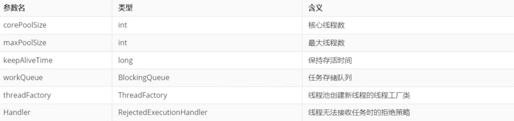
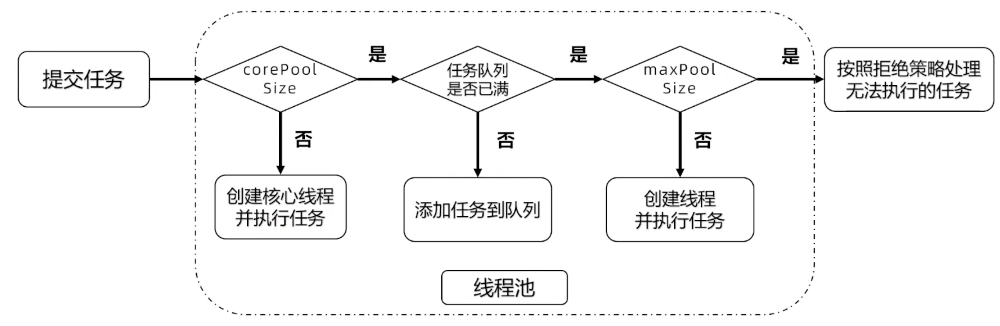
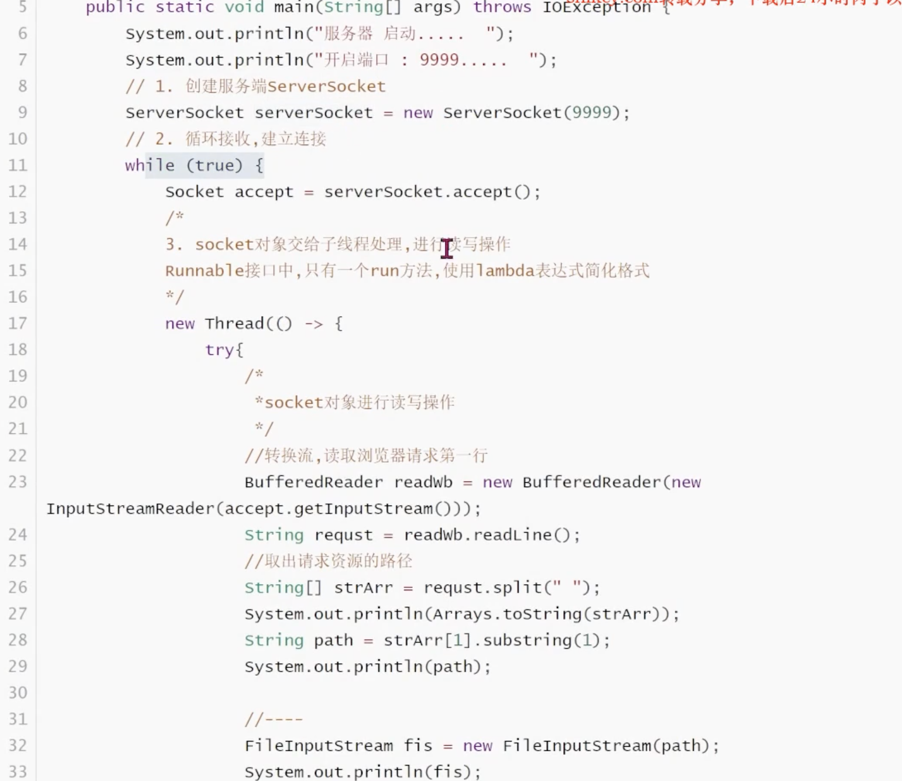
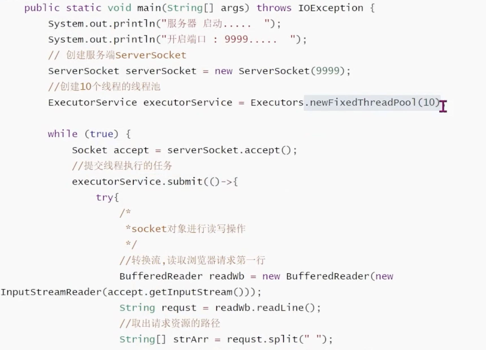
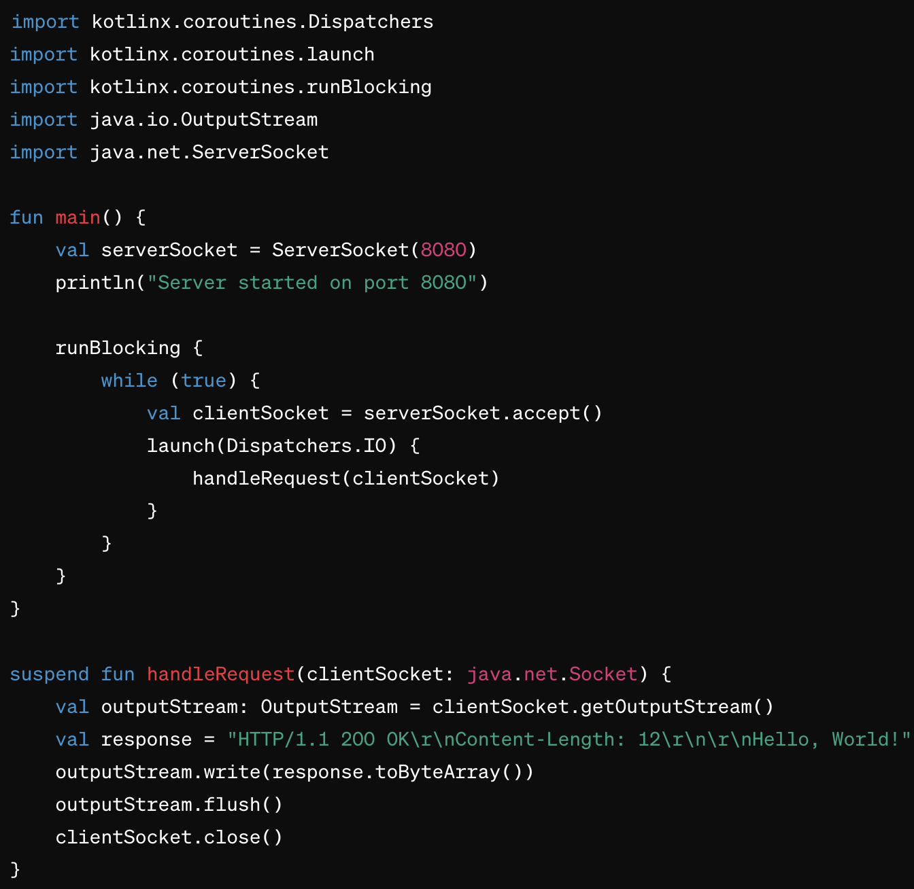
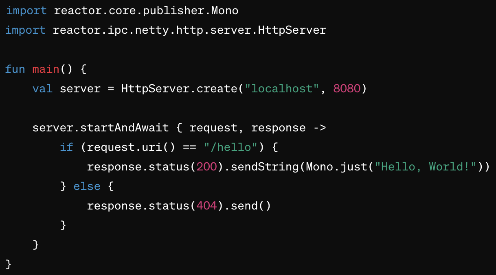

- ThreadPool #线程池
	- 基于 #池化思想 管理线程的工具。
	- 维护多个线程，等待监督和管理分配可并发执行的任务
		- 避免频繁创建线程销毁线程的开销，提升系统整体性能
- 优点
	- 降低资源消耗
		- 通过线程池复用线程，降低创建线程和释放线程的损耗
	- 提高响应速度
		- 任务到达时，无需等待即刻运行
	- 提高线程的可管理性
		- 使用线程池可以进行统一的线程分配、调优和监控
	- 提供可扩展性
		- 线程池具备可扩展性，研发人员可以向其中增加各种功能，比如：延时、定时、监控
- 场景
	- 连接池
		- 预先申请数据库连接，提升申请连接的速度，降低系统的开销（跨网络应用都需要线程池）
	- 线程隔离
		- 服务器接收大量请求，使用线程池来进行隔离处理
- 核心参数
	- 
	- corePoolSize
		- 核心线程数，可以理解为空闲线程数，即便线程空闲（Idle），也不会回收
	- maxPoolSize
		- 最大线程数，线程池可以容纳线程的上限
	- keepAliveTime
		- 线程保持存活的时间，超过核心线程数的线程存活空闲时间超过 keepAliveTime 后就会被回收
	- workQueue
		- 工作队列
			- 直接交换队列 SynchronousQueue
			- 无界队列 LinkedBlockingQueue
			- 有界队列 ArrayBlockingQueue
	- threadFactory
		- 线程工厂，用来创建线程的工厂，线程都是出自于此工厂
	- Handler
		- 线程无法接收任务时的拒绝策略
	- 
	- 提交任务，如果线程数小于corePoolSize即使其他线程处于空闲状态，也会创建一个新线程来运行任务
	- 如果线程数大于corePoolSize，但少于maxPoolSize，将任务放入工作队列
	- 如果队列已满，并且线程数小于maxPoolSize，则创建一个新线程来运行任务。
	- 如果队列已满，并且线程数大于或等于maxPoolSize，则拒绝该任务。
-
- 创建线程池
	- newFixedThreadPool
		- corePoolSize = maxPoolSize, keepAliveTime = 0
		- 创建一个固定大小的线程池，线程数量固定不变
			- 如果线程池中的线程数量小于核心线程数，则会创建新线程来处理任务
				- 通过 `corePoolSize` 参数指定
			- 如果线程池中的线程数量达到核心线程数，则新任务会被放入任务队列中等待执行
				- 默认无界任务队列， `LinkedBlockingQueue`
		- 适用于执行长时间任务的场景，可以控制线程的数量，避免资源耗尽。
	- newSingleThreadExecutor
		- corePoolSize = maxPoolSize = 1, keepAliveTime = 0
		- 创建一个单线程的线程池，该线程池中只有一个线程在工作
			- 当有新的任务提交到线程池时，任务会被放入任务队列中等待执行，然后线程池中的唯一线程会按照任务的提交顺序依次执行
				- 无界任务队列， `LinkedBlockingQueue`
		- 适用于需要顺序执行任务且不需要并发执行的场景
	- newCachedThreadPool
		- corePoolSize = 0, maxPoolSize = Integer.MAX_VALUE, keepAliveTime = 60s
		- 创建一个可缓存的线程池，该线程池中的线程数量是根据需要动态调整的
			- 当有新的任务提交到线程池时，线程池会根据当前的负载情况动态地创建新的线程来处理任务
				- 无界的任务队列， `SynchronousQueue`
			- 如果线程池中的线程空闲超过一定时间，则会被销毁
				- 由 `keepAliveTime` 参数指定
		- 适用于执行短时间任务且任务量不确定的场景，可以根据实际需要动态地调整线程数量，避免资源浪费。
	- newScheduledThreadPool
		- corePoolSize = input, maxPoolSize = Integer.MAX_VALUE, keepAliveTime = 10s
		- 创建一个定时调度线程池，该线程池中的线程可以定期执行任务或者延迟执行任务
			- 通过 `scheduleAtFixedRate()` 方法执行定时任务
			- 通过 `scheduleWithFixedDelay()` 方法延迟任务
			- 无界的任务队列，`DelayedWorkQueue`
		- 适用于需要定时执行任务或者延迟执行任务的场景，例如定时任务调度、定时数据清理等。
	- ThreadPoolExecutor
		- 创建自定义线程池的一个类，它实现了 `ExecutorService` 接口
		- 可以灵活地配置线程池的各种属性，如核心线程数、最大线程数、任务队列、线程工厂
		- 推荐设置
			- CPU密集
				- 线程数量不能太多，可以设置为与相当于CPU核数
			- IO密集
				- 可以设置的线程数量多一些，可以设置为CPU核心数的2倍
			- 如何判断是哪种？
				- 观察 CPU 和 IO 使用率
					- CPU 使用率较高，但 I/O 操作相对较少，可能是 CPU 密集型任务
					- CPU 使用率较低，但程序在进行大量的 I/O 操作，可能是 I/O 密集型任务
				- 观察线程的状态
					- 线程在运行过程中大部分时间都处于阻塞状态，等待 I/O 操作完成，那么可能是 I/O 密集型任务。
					- 线程在运行过程中大部分时间都处于运行状态，进行大量的计算操作，那么可能是 CPU 密集型任务。
				- 观察程序的性能特征
					- I/O 密集型任务会涉及大量的文件读写、网络通信等 I/O 操作
					- CPU 密集型任务则主要涉及大量的计算和处理操作
			- 拒绝时机
				- 最大线程和工作队列超限
				- Executor 关闭
				-
- 利用线程池自定义服务器
	- 手动创建线程
		- 
	- 通过线程池创建线程
		- 
	- kotlin coroutine 自动管理线程
		- 不需要显式地管理线程池的，Kotlin Coroutine 提供了一种更高层次的抽象，可以自动管理线程的分配和调度。Kotlin Coroutine 使用的是一种称为调度器（dispatcher）的机制，它负责将挂起的协程分发到可用的线程执行。
		- 
	- Java Project Reactor
		- 不需要显式地管理线程池，Project Reactor 提供了一种称为调度器（Scheduler）的机制，可以自动管理线程的分配和调度。调度器负责将异步任务分发到可用的线程执行，并支持灵活的线程池配置。
		- 