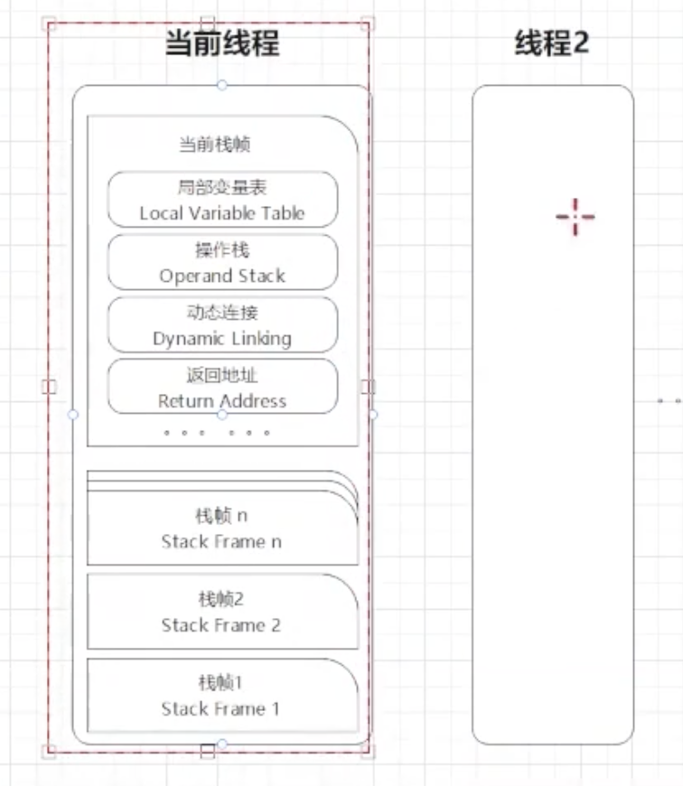

- WHAT
	- 栈帧（Stack Frame）
		- 一种数据结构
			- 局部变量表
			- 操作数栈
			- 动态连接
			- 方法返回地址
		- 是用于支持虚拟机进行的**方法执行**。
	- 入栈出栈
		- 先进后出
		- 方法从调用到执行完成的过程
	- 栈内存
		- 线程的私有空间
		- 栈内存大小决定了方法调用的深度
			- 栈内存过小则会导致方法调用的深度较小，如递归调用的次数较少。
		- {:height 518, :width 385}
- When
	- 每个线程都会创建一个栈内存
	- 调用新的方法，都会创建一个栈帧
- 异常
	- StackOverflowError
		- 线程请求的栈的调用深度超过JVM限制的最大深度
			- 通过`-Xss`选项，您可以指定每个线程的栈大小，以控制线程在执行时可以调用多少嵌套方法
				- By default: 1MB
	- OutOfMemoryError
		- 在创建新的线程时，没有足够的内存去创建对应的虚拟机栈
-
- Ref: [[本地方法栈]]
-