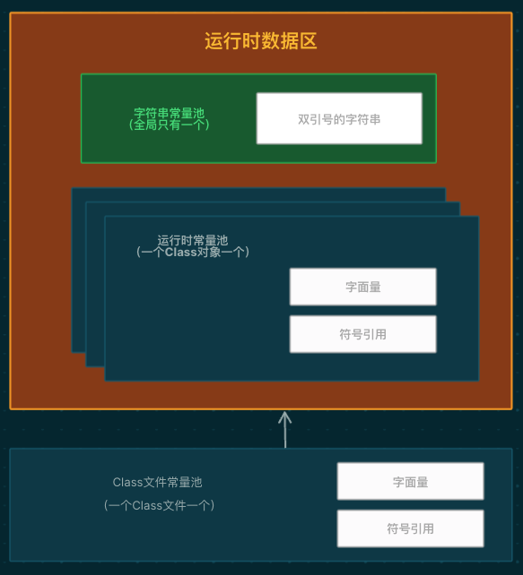

- Runtime Constant Pool
- What
	- 是JVM中的一部分，它实际上是方法区的一部分。
	- 包含了类文件中的常量池表中的一部分或全部内容，主要用于存储类结构相关的信息
		- 符号引用
		- 字面常量
		- 其他编译期生成的信息
	- 在类加载时被加载到方法区（或在一些新的JVM实现中的元数据区Metaspace）中的运行时常量池中，由两部分组成：
		- **元数据区中的运行时常量池**：类文件中的常量池表的信息，包括类、方法、字段的符号引用，字面常量，方法句柄，方法类型等。在一些旧版本的JVM中，这被称为"永久代"（Permanent Generation），但在新版本的JVM中，通常被称为"元数据区"（Metaspace）。这部分常量池用于存储与类结构相关的常量和符号引用信息。
		- **堆中的字符串池**：字符串池是运行时常量池的一部分，但它不位于方法区或元数据区，而是在Java堆中。字符串池用于存储字符串字面量，它包括在类中的字符串常量、直接使用双引号创建的字符串、字符串通过`String.intern()`方法添加到池中的字符串等。字符串池的目的是提高字符串的共享和重用，以节省内存。
		- [[运行时数据区-常量池-图]]
		  id:: 6538b7ee-231f-4c86-8c48-ea2e431e990f
			- 
			- 三种常量池
				- Class文件常量池
				- 运行时常量池
					- 元数据区
				- 字符串常量池
					- 堆
- 字面量
	- int
	- float
	- long
	- double
	- 双引号字符串
- 符号引用
	- Class
	- Method
	- Field
-
- [[字符串常量池]]
	- String Constant Pool
	- 使用StringTable存储，类似于 #哈希表
		- key：散列函数，公式：hash（字符串）% 数组size
		- value： 字符串的引用
		- size: -XX:StringTableSize=65536
			- size影响 查询效率（碰撞次数）
	- ```java
	  String s1 = "Hello, World"; // 编译期就会存储在字符串常量池
	  String s2 = "Hello, World"; // 直接引用常量池中的字符串
	  
	  String s3 = new String("Hello, World"); // 创建一个新的字符串对象在堆内存中
	  
	  System.out.println(s1 == s2); // 输出 true，因为它们引用相同的字符串常量池中的对象
	  System.out.println(s1 == s3); // 输出 false，因为s3是在堆内存中创建的新对象
	  ```
	- 总结
		- 单独使用双引号创建的字符串都是常量，编译期就已经确定存储到String Pool中。
		- new String创建的对象会存储到heap中，是运行期新创建的。
		- 只包含常量的字符串连接符如"aa"+"bb"创建的也是常量，编译期就已经存储到String Pool中。
		- 包含变量的字符串连接 ”aa”"+ str 创建的对象是运行期才创建的，存储到heap中。
		- 运行期调用 String 的 intern() 方法可以向 String Pool 中动态添加对象。
	- GC
		- 字符串常量池中的字符串对象通常不会被垃圾回收，除非类加载器（ClassLoader）被回收