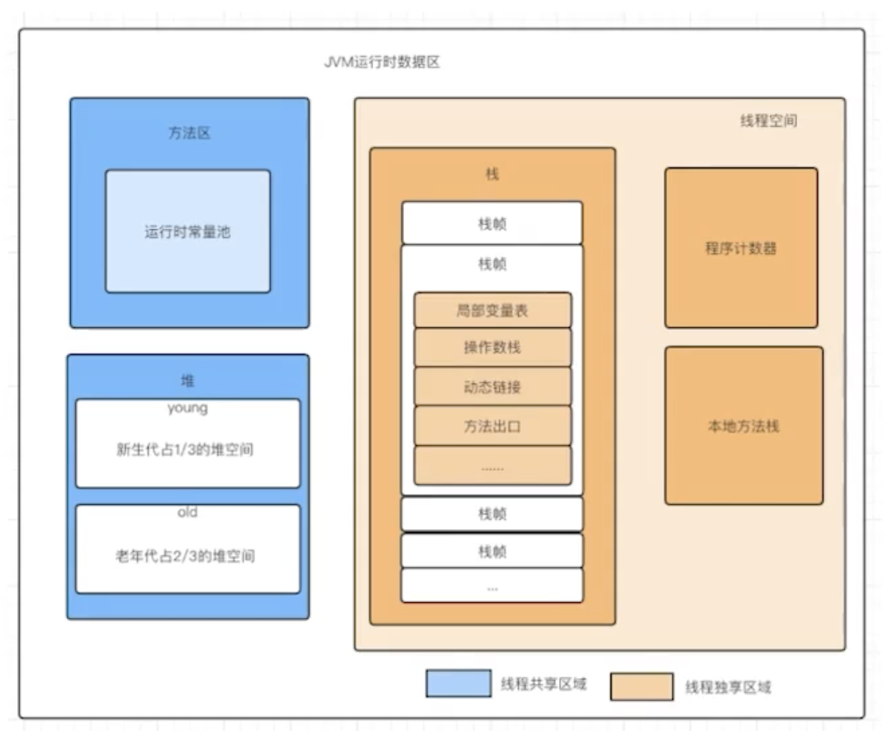

- JVM的运行时数据区包含了多个不同的内存区域
	- **堆（Heap）**
		- #Heap
		- 堆是用于存储对象实例的内存区域。它是Java程序中动态分配内存的主要区域，包括新生代和老年代等部分。
	- **方法区（Method Area）**
		- #[[Method Area]]
		- 方法区用于存储类的元数据信息，如类的结构、字段和方法信息、静态变量、常量池等。方法区在一些JVM实现中也被称为"永久代"，尽管在新版本的JVM中，"永久代"已被"元数据区"（Metaspace）所取代。
	- **栈（Stack）**
		- #Stack
		- 栈用于存储方法调用的局部变量、操作数栈和方法调用/返回信息。每个线程都有自己的栈，包括一个执行线程栈（Execution Stack）和一个本地方法栈（Native Method Stack）。
	- **程序计数器（Program Counter）**
		- #[[Program Counter]]
		- 程序计数器是当前线程执行的字节码指令的地址计数器。每个线程都有自己的程序计数器。
	- **本地方法栈（Native Method Stack）**
		- #[[Native Method Stack]]
		- 本地方法栈用于执行本地方法，这些方法通常由本地库实现，与JVM关联。
- 
- 按照线程使用情况和职责分成两大类
	- 线程独享 - 程序执行区 - 不需要GC
		- [[虚拟机栈]]
		- [[本地方法栈]]
		- [[程序计数器]]
		- [[直接内存]]
	- 线程共享 - 数据存储区 - 需要GC
		- [[堆]]
		- [[方法区]]
			- [[运行时常量池]]
		- 静态数据
		- 对象数据