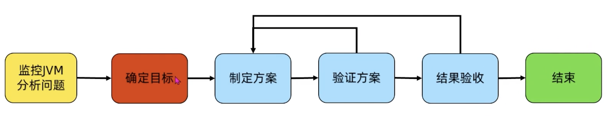
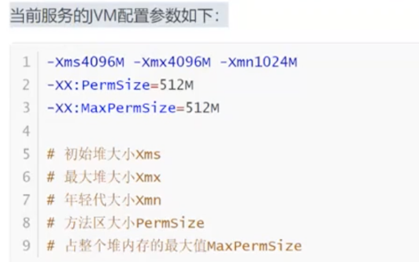
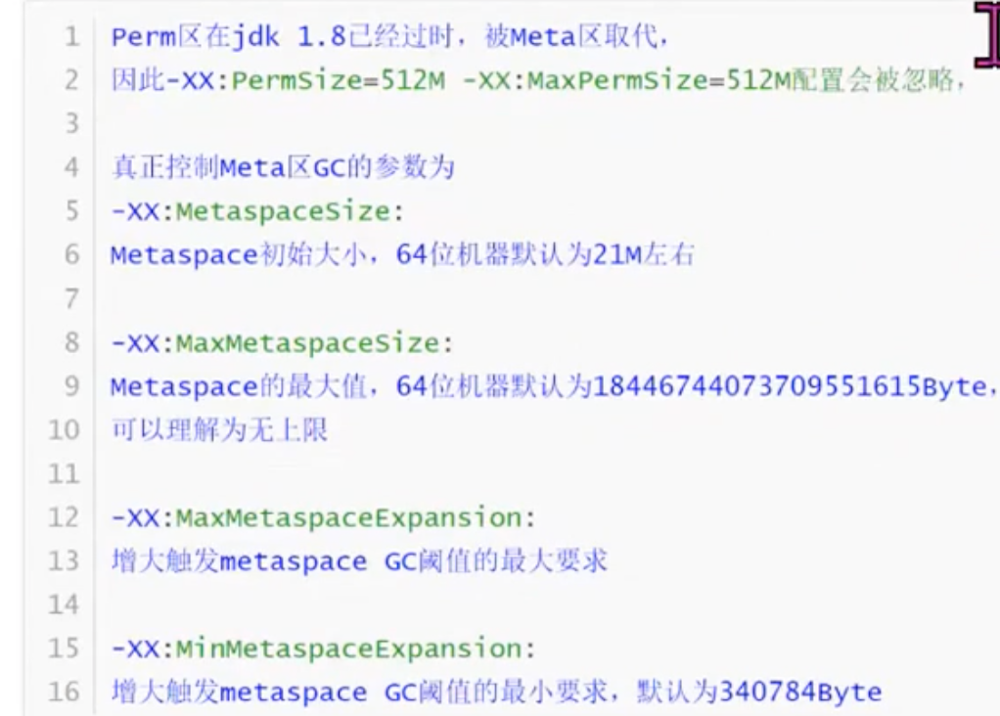
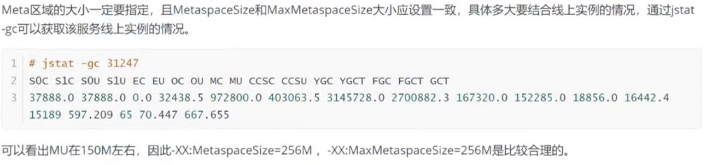
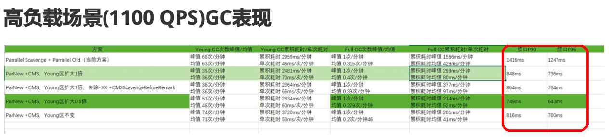
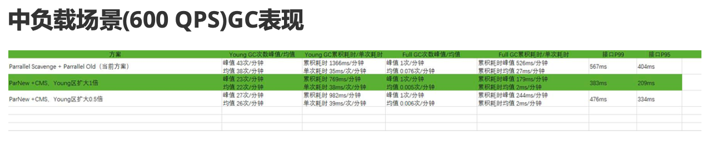

- 
- 场景
	- 某核心接口高峰期RT超1400ms影响用户体验
	- RT慢主要体现在P99高
- GC监控
	- 平均每10分钟Young GC次数66次，峰值为470次；
	- 平均每10分钟Full GC次数0.25次，峰值5次；
- 初步分析
	- Full GC 过于频繁，Young GC 也比较频繁
	- 优化GC时间可以降低P99的RT
		- 假设已经排除了代码的问题
- 目标
	- P99延时降低30%
	- 高负载单机 1000QPS
	- 中负载单机 500QPS
	- 低负载单机 200QPS
- 分析问题
	- Young 区配比不合理
		- {:height 239, :width 402}
		- 年轻代太小（老年代的3-4倍），实际需要压测看情况调整
	- 没有指定GC垃圾收集器
		- jdk8 默认PS + PO 吞吐量优先，不是延迟优先
	- 未设置Metaspace
		- {:height 358, :width 490}
		- Metaspace扩容时会触发full gc
-
- 优化方案
	- 垃圾收集器
		- 使用低延时的垃圾回收器
			- PN + CMS
			- G1
			- ZGC
	- Metaspace一定要指定
		- 
	- 扩大Young区
		- 反复测试
			- 1倍
			- 0.5倍
			- 不变
- 验证
	- [[压力测试]]
	- 不能单独看高负载，要[[梯度压测]]
	- 
	- 
	- 为了保证用户体验，选择高负载表现最好的 Young区扩大0.5倍
- 发布线上
	- 持续观测
	- 验证目标是否达成